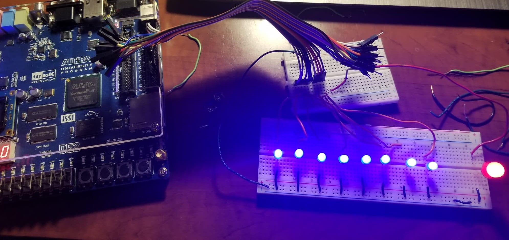
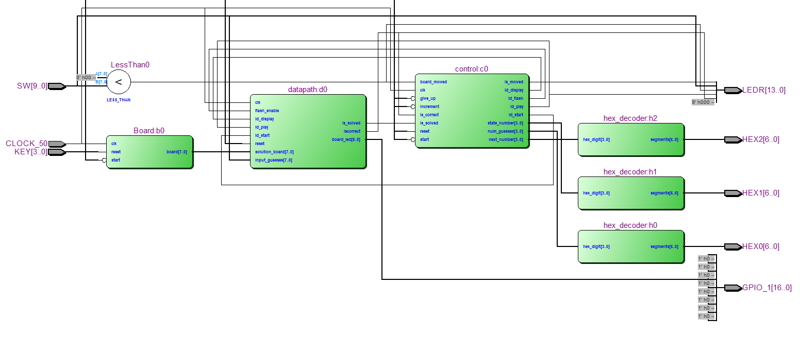

# __Project Report: Memory-Matrix__

##### Michael Lee, Victor Trinh  

https://github.com/Michael-Chunman-Lee/Memory-Matrix  

## Description
Memory-Matrix is an implementation of a memory-based game. The gameplay is as
follows;
1. The player starts the game by pressing KEY[1]. Then, they press KEY[3] a number of times
to increment the number of allowed mistakes. The number of remaining mistakes is
shown on the HEX Displays. This gameplay state is indicated by a flashing LED.
2. The player presses KEY[1] once again to start the game.
3. A number of randomly selected LEDs turn on briefly for the player to memorize.
4. The LEDs turn off and the player attempts to flip the switches corresponding to
the previously lit LEDs. Flipping an incorrect switch decrements the remaining
number of allowed mistakes. The player can also press KEY[2] to give up at any point during the game.
1. The game ends when either the player runs out of allowed
guesses or when the player flips all the correct switches. The end of a game is
indicated by the same flashing LED as in (1). To play again, KEY[1] may be pressed.

## Materials
* Basic Assorted wires
* DE1/DE2 Board
* LEDs (8 + 1)
  * The extra LED may be different from the main gameplay LEDs.
  * https://www.creatroninc.com/product/3mm-led-blue-10-pack/?search_query=led+&results=477
  * https://www.creatroninc.com/product/10mm-led-red-5-pack/?search_query=led+&results=477
* Breadboard
  * https://www.creatroninc.com/product/full-size-breadboard-white/?search_query=breadboard&results=219
* M-F Jumper Wires (10)
  * https://www.creatroninc.com/product/3-m-f-jumper-wire-10-pack/?search_query=jumper+wires&results=55   
  * Alternatively, a 2xn header cable may be used.

## Block Diagram

