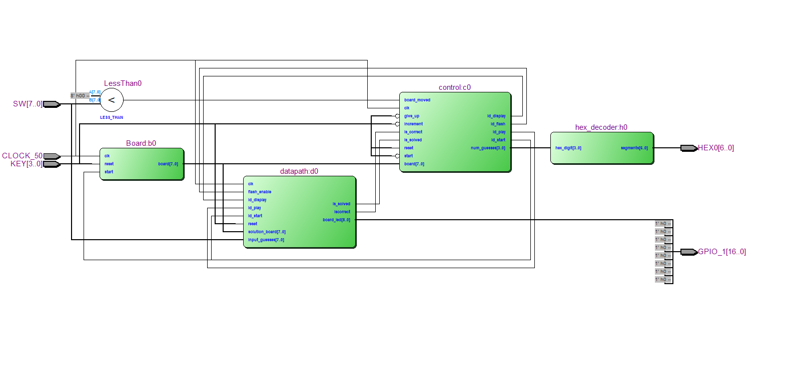

# __Project Report: Memory-Matrix__
###### Michael Lee, Victor Trinh
https://github.com/Michael-Chunman-Lee/Memory-Matrix

## Contents
1. High-Level Description
2. Materials
3. Block Diagram

## Description
Memory-Matrix is an implementation of a memory-based game. The gameplay is as
follows;

1. The player presses key_3 to increment the number of allowed mistakes. The
number of remaining mistakes is shown on the HEX Displays. This gameplay state
is indicated by a flashing LED.
2. The player presses key_1 to start the game.
3. A number of randomly selected LEDs turn on briefly for the user to memorize.
4. The LEDs turn off and the player attempts to flip the switches corresponding to
the previously lit LEDs. Flipping an incorrect switch decrements the remaining
number of allowed mistakes.
5. The game ends when either the player makes a mistake after running out of allowed
mistakes or when the player flips all the correct switches. The end of a game is
indicated by the same flashing LED as in (1). To play again, key_1 may be pressed.

## Materials
* Assorted wires
* FPGA
* LEDs (8 + 1)
* Breadboard
* Header Cables/Wires

## Block Diagram

